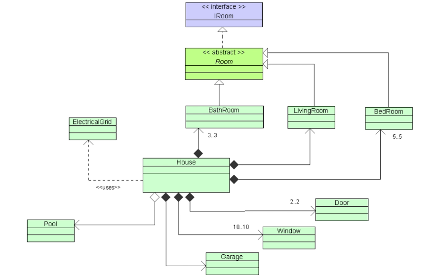
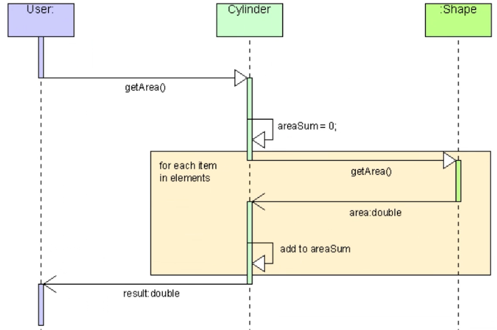

# 🔷  UML (Unified Modeling Language)

UML helps us **visualize**, **design**, and **document** the structure and behavior of software systems.

It provides diagrams to model:

- Structural relationships (how things are built and connected)
- Behavioral relationships (how things interact over time)

---

## Class Diagram

- It is used to construct and visualize object-oriented relationships.
  
  - **Class Information**
    - Attributes
    - Operations
      
  - **Class Relations**
    - Generalization
    - Association
    - Dependencies

    

## Composition vs Aggregation in UML

### 🚻 Composition (Black Diamond)

Represents a **strong "whole-part" relationship** where the part **cannot exist independently** of the whole.

> **Example:** A **Bathroom** is part of a **House**. If the House is destroyed, the Bathroom ceases to exist.

---

### 🏊 Aggregation (White Diamond)

Represents a **weak "whole-part" relationship** where the part **can exist independently** of the whole.

> **Example:** A **Pool** may be associated with a **House**, but it can exist even without the House.

---

## Sequence Diagram

- It is used to visualize object-oriented behaviour.
  
  - **Interaction Information**
    - **Actors:** External users or systems interacting with the system.
    - **Objects/Participants:** Instances involved in the interaction.
    - **Lifelines:** Show the lifetime of an object during the scenario.
    - **Messages:** Calls or signals sent between objects or actors.
    - **Activation Bars:** Show when an object is active or processing.
    - **Return Messages:** Indicate responses or returned data.
    - **Self-Messages:** When an object sends a message to itself.
      

